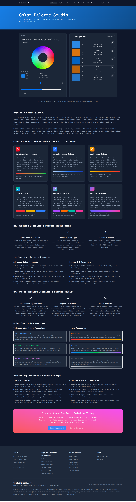
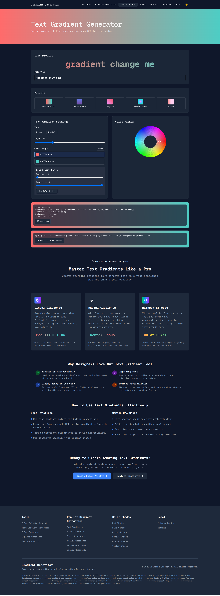

# 🎨 Gradient Generator - Professional Color Tools Suite

Welcome to the ultimate gradient and color palette generator! This comprehensive web application provides professional-grade tools for designers and developers to create stunning gradients, color palettes, and text effects with ease.

## 🎯 Purpose of the Project

This project was created to solve the common pain points designers and developers face when working with colors and gradients:

- **Time-consuming manual gradient creation** - Our tools generate beautiful gradients instantly
- **Limited color palette options** - Professional color harmony schemes at your fingertips  
- **Complex CSS syntax** - Copy-paste ready code for both vanilla CSS and Tailwind CSS
- **Lack of comprehensive color tools** - All-in-one solution for gradient, palette, and text styling needs
- **Accessibility concerns** - Built with modern web standards and responsive design

The goal is to democratize professional color design tools and make them accessible to everyone, from beginners to expert designers.

## ✨ Key Features

### 🌈 **Advanced Gradient Generation**
- Linear and radial gradient support
- Multiple color stops with precise control
- Real-time preview and editing
- Professional-grade color blending algorithms
- Export to CSS and Tailwind CSS formats

### 🎨 **Color Palette Studio**
- **Complementary**: Perfect opposite colors for high contrast
- **Monochromatic**: Single hue with varying lightness and saturation
- **Analogous**: Adjacent colors on the color wheel for harmony
- **Triadic**: Three evenly spaced colors for vibrant schemes
- **Tetradic**: Four colors forming a rectangle for rich palettes
- Interactive color wheel with HSV/HSL/RGB/HEX support

### 📝 **Text Gradient Generator**
- Beautiful gradient text effects
- Live preview with customizable text
- CSS `background-clip: text` implementation
- Tailwind CSS utility class generation
- Perfect for headings and call-to-action text

### 🔧 **Developer-Friendly Tools**
- One-click copy functionality for all code snippets
- Both vanilla CSS and Tailwind CSS output
- Responsive design that works on all devices
- Clean, semantic code generation
- Performance-optimized gradient rendering

## 📄 Main Pages Overview

### 🏠 **Home Page** (`/`)
The main gradient generator interface featuring:
- Interactive gradient builder with multiple color stops
- Real-time preview with customizable background
- Instant CSS and Tailwind CSS code generation
- Comprehensive gradient education content
- Modern, responsive design with accessibility features

### 🎨 **Color Palette Studio** (`/palette`)
Professional color scheme generator offering:
- Five scientifically-backed color harmony schemes
- Interactive color wheel for precise color selection
- Adjustable palette sizes (2-8 colors)
- HSV, HSL, RGB, and HEX color format support
- Export functionality for design workflows

### 🌟 **Gradient Explorer** (`/gradient/explore`)
Curated collection of professional gradients:
- Categorized gradient library (Sunset, Ocean, Forest, etc.)
- Pagination and filtering system
- Featured gradient highlights
- Copy-to-clipboard functionality
- Comprehensive gradient education guides

### ✍️ **Text Gradient Generator** (`/text-gradient`)
Specialized tool for gradient text effects:
- Live text preview with editable content
- CSS `background-clip: text` implementation
- Tailwind CSS utility class generation
- Perfect for modern web typography
- Mobile-responsive gradient text rendering

### 🎯 **Color Converter** (`/color-converter`)
Universal color format converter:
- Convert between HEX, RGB, HSL, and HSV
- Real-time color preview
- Copy functionality for all formats
- Perfect for design consistency

### 🌈 **Color Explorer** (`/explore-colors`)
Comprehensive color reference tool:
- Extensive color shade collections
- Named color references
- Color accessibility information
- Design inspiration gallery

## � Screenshots

### Color Palette Generator


### Text Gradient Generator


## �🛠️ Technologies Used

### **Frontend Framework**
- **Next.js 14** - React framework with App Router for optimal performance
- **React 18** - Modern React with hooks and concurrent features

### **Styling & UI**
- **Tailwind CSS** - Utility-first CSS framework for rapid development
- **Tailwind CSS Gradients** - Built-in gradient utilities
- **shadcn/ui** - High-quality, accessible UI components
- **Lucide React** - Beautiful, customizable icons

### **Color Science & Mathematics**
- **Custom Color Algorithms** - Proprietary HSV/HSL/RGB conversion functions
- **Color Harmony Theory** - Mathematical implementation of color schemes
- **Gradient Interpolation** - Advanced color blending algorithms

### **Developer Experience**
- **MDX** - Markdown with JSX for content management
- **Hot Reload** - Instant development feedback
- **TypeScript Support** - Type safety and better developer experience

### **Performance & SEO**
- **Static Site Generation (SSG)** - Pre-rendered pages for optimal performance
- **Incremental Static Regeneration (ISR)** - Dynamic content with static performance
- **Optimized Sitemap** - SEO-friendly URL structure
- **Responsive Images** - Automatic image optimization

### **Deployment & Hosting**
- **Vercel** - Edge-optimized hosting with global CDN
- **Automatic Deployments** - CI/CD integration with GitHub

## 🚀 Getting Started

1. **Clone the repository**
   ```bash
   git clone https://github.com/yourusername/gradient-generator.git
   cd gradient-generator
   ```

2. **Install dependencies**
   ```bash
   npm install
   # or
   yarn install
   # or
   pnpm install
   ```

3. **Run the development server**
   ```bash
   npm run dev
   # or
   yarn dev
   # or
   pnpm dev
   ```

4. **Open your browser**
   Navigate to [http://localhost:3000](http://localhost:3000) to see the application.

## 🌟 Contributing

We welcome contributions from the community! Whether you're:
- 🐛 Reporting bugs
- 💡 Suggesting new features  
- 🔧 Submitting code improvements
- 📖 Improving documentation
- 🎨 Adding new gradient presets

Please feel free to open an issue or submit a pull request.

## 📄 License

This project is open source and available under the [MIT License](LICENSE).

## 🙏 Thank You!

Thank you for visiting our Gradient Generator tool! This project represents countless hours of development, design, and optimization to bring you the best color tools on the web.

### 💫 **If this tool helped you create something beautiful, please:**

⭐ **Star this repository** to show your support  
🍴 **Fork the project** to contribute or customize  
📢 **Share with fellow designers and developers**  
💌 **Follow us** for updates and new features

Your support helps us continue improving and adding new features to make color design accessible for everyone!

---

**Made with ❤️ for the design and developer community**

*Happy designing! 🎨*